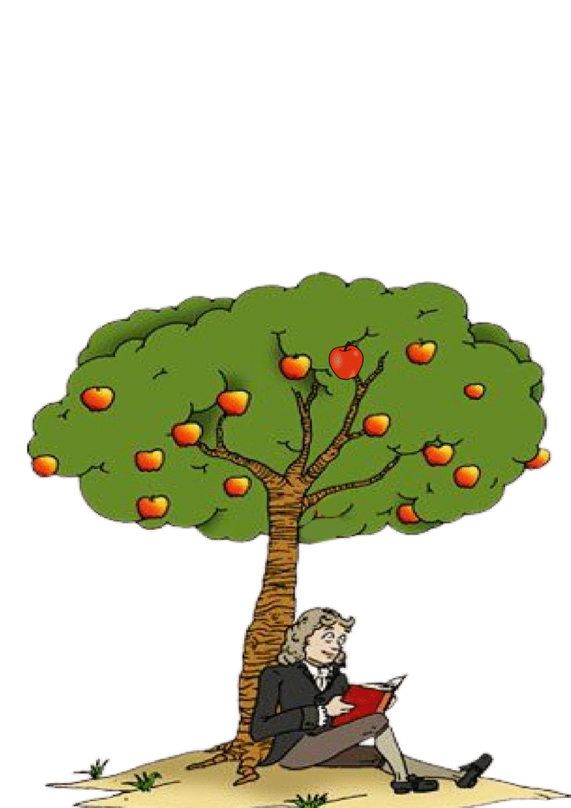

# flipbook-compiler
A simple compiler in python to generate pdf flipbooks quickly and easily

## Approach 
There are 4 major modules in this project - lexerGenerator, parserGenerator, pdfMaker and astNode. 
- **lexerGenerator** defines the tokens and converts a sequence of characters into sequence of tokens
- **parserGenerator** defines the production rules recognised by the compiler for the syntax analysis phase
- **pdfMaker** defines the class which contains the functions to generate the pdf from images
- **astNode** contains the definitions for all the node classes

**run.py** is the main engine which connects all the above mentioned components to generate the pdf flipbook.

## Packages used
- rply
- pyPDF2
- fpdf

## How to run:-
- Install dependencies - `pip3 install -r requirements.txt`
- Store the images to be used in `images` directory
- To start the script - `python3 run.py <flp file> <output pdf>`

## Statement Syntax
exec ( for(1, 4) initImage(0, 100, 50, 50) scale(1.1) shift(5, 0) kid.png )
### Method Syntax
- `exec` - parent method which executes the statement written inside it
- for(startIdx, endIdx) - defines the number of pages the images should be printed on
- initImage(x, y, szX, szY) - defines the initial position and size of the image
- scale(value) - defines the scale update to make at each page
- shift(x, y) - shifts the image from initial position on each subsequent page
- <imageFile> - defines the image to be used for current statement

## Sample Outputs(Converted to gif from pdf for better visualization)

Human Evolution | Newton's Apple
:--------------:|:--------------:
 | 
